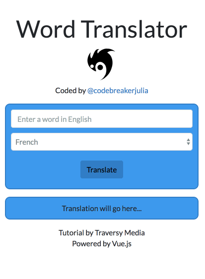

# vuejs-translator-app

> A Vue.js tutorial by [Traversy](https://www.youtube.com/watch?v=DBADrF0C2ls)

Created on DAY FOUR of #30daysofcode - Sunday, August 12, 2018

Project notes [here](https://docs.google.com/document/d/1EP-3C6rCT65YHE2yE_qDek_GhLgBj3dV7GTwEYQWPlg/edit?usp=sharing)



## Build Setup

``` bash
# install dependencies
npm install

# serve with hot reload at localhost:8080
npm run dev

# build for production with minification
npm run build

# build for production and view the bundle analyzer report
npm run build --report
```

For a detailed explanation on how things work, check out the [guide](http://vuejs-templates.github.io/webpack/) and [docs for vue-loader](http://vuejs.github.io/vue-loader).
